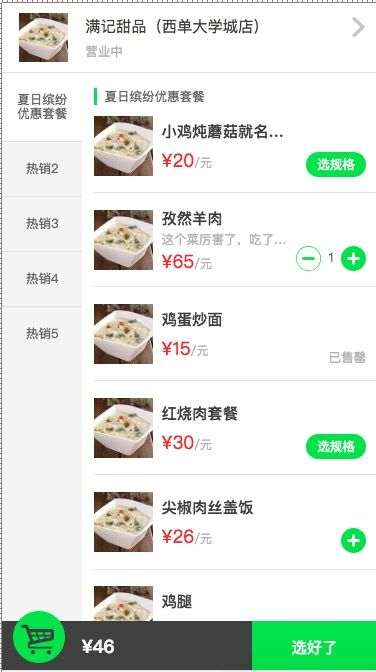
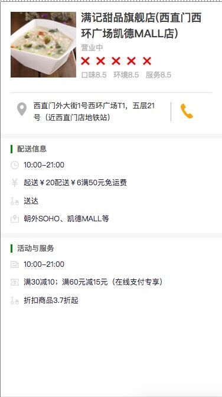
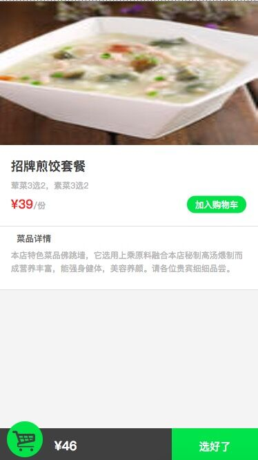
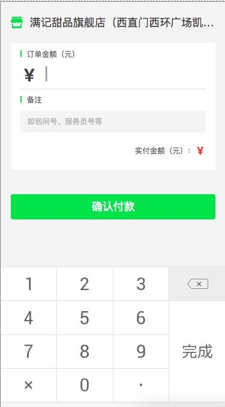
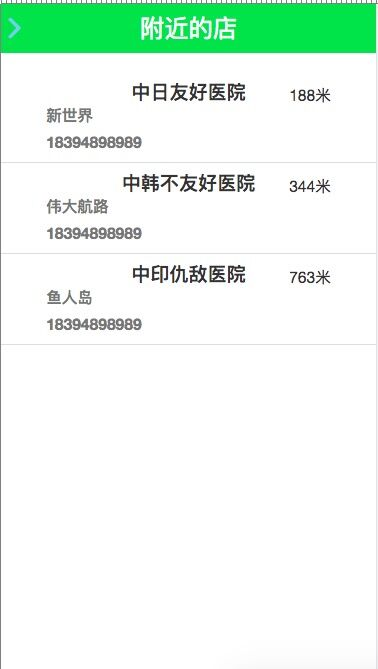
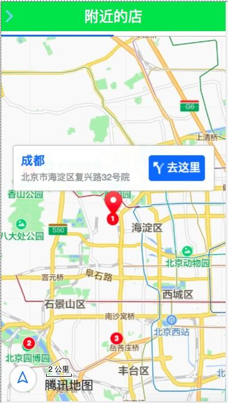

# 模拟微信点餐
wechat-restaurant
> ### 项目介绍
```
A Vue.js project 一个用vue实现的微信点餐的项目
```
> ### 技术栈
```
vue,vue-router,sass,better-scroll,vue-cli,Javascript,es6,mock,ESlint,webpack,bable等等
```
> #### 项目简介
```
1.微信点餐系统，主要由商家内容，菜单列表，用户地址，附近定位以及订单查询等组成，
2.本项目中商家内容和菜单列表等主要利用vue框架以及依赖于vue的。
4.用户地址用户手动输入。
5.附近定位我们需要调用腾讯或百度地图
6.购物车等很多地方都运用同样的技术，所以需要封装很多公共的组件。
7.vue-router：使用<router-link>组件完成导航
8.SASS：编译后成正常的CxSS文件。方便写style样式
9.better-scroll：实现列表左右联动效果
10.vue-cli：vue脚手架 创建项目结构
11.Javascript语法
12.es6的语法,代码更加简洁
13.项目起初先模拟mock数据，当项目能本地跑通后再连 接口的数据。
14.ESlint：统一代码风格，规避低级错误
15.webpack：打包所有脚本,图片,资源,样式,表
16.bable：es6有的浏览器不兼容需要将es6转义成es5语法
```

> #### 项目结构
```
demo1
    |—— build  // 构建脚步目录，保存一些webpack的初始化配置
    |—— config  // 构建配置目录，项目初始化的配置，包括端口号等
    |—— node_modules  // npm加载的项目依赖的模块
    |—— src  //源码目录，这里是我们要开发的目录，基本上要做的事情都在这个目录里
    |    |——assets  // 资源目录，用来放置图片，如logo等
    |    |    |——css  // css 样式
    |    |    |——fonts  // icon 图标
    |    |——components  // 组件目录，用来放组件文件
    |    |    |——back  // 背景 加载前的svg图
    |    |    |——load  // 动画
    |    |——containers  // 路由的容器
    |    |    |——Menu  // 菜单组件
    |    |——router  // 路由相关配置
    |    |——utils  // 全局的方法
    |    |——App.vue  // 是项目入口文件
    |    |——main.js  // 是项目的核心文件
    |—— static  // 文件夹用来放置静态资源目录，如图片、字体等。
    |    |——mock  // 模拟的mock数据
    |    |    |——address.js  // 我的地址数据
    |    |    |——nearbyShop.js  // 附近的店数据
    |    |    |——orderDetail.js  // 订单页面数据
    |    |    |——shop.js  // list的数据数据
    |—— .babelrc babel  // 编译参数，vue开发需要babel编译
    |—— .gitignore  // 用来过滤一些版本控制的文件，比如node_modules文件夹
    |—— .eslintrc.js  // 项目规范
    |—— index.html  // 是首页入口文件，你可以添加一些 meta 信息或统计代码啥
    |—— package.json  // 是项目配置文件，记载着一些命令和依赖还有简要的项目描述信息
    |—— README.md  // 项目的说明文档，markdown 格式，项目的介绍,接口文档
```
> #### 项目流程
```
1.商品列表页可以进行better-scroll 左和右都可以进行切换，左列有5个tabs可以切换右边，右边上拉切换，下拉加载并相应切换左边的tab。
2.点击顶部的商家跳转路由进入到商家详情页。
3.在列表页可以将商品添加购物车，并可以跳转到商品详情页。
4.点击购物车，在页面获取到购物车的数据，（不跳转页面），※！！！（列表页，商品详情页，都有购物车）
5.确认订单，点击选择收货地址进入到地址页面，选择好地址，在跳转到订单页。
6.点击去支付，跳转到支付页，输入金额时，调取到手机键盘。
7.订单可以查询到所有的订单信息。已完成，已退款（1.线上支付 2.自提），待付款
8.附近的店页 是定位到自己的位置，通过腾讯或百度地图查找附近的店。
9.点击店名，跳转路由，跳到当前点击店的详细位置，（通过地图显示店所在地图上的位置）
10.我的地址，有3个功能：1.配送范围内的地址高亮，2.配送范围外的地址，禁止选择，3.可以新增收货位置。
11.点击新增收货地址，跳转页面，填写信息，点确定，返回我的地址页面，并添加新地址
```
> #### 注意
```
1.h5页面 （%,弹性）
2.组件划分
```
## Build Setup （建立设置）
``` bash
# install dependencies （安装依赖关系）
npm install

# serve with hot reload at localhost:8080 （在本地主机8080上提供热重载服务）
npm run dev

# build for production with minification （以小型化生产为目标 打包生成dist文件） 
npm run build

# run all tests （运行所有测试）
npm test
```
> 部分截图







For a detailed explanation on how things work, check out the [guide](http://vuejs-templates.github.io/webpack/) and [docs for vue-loader](http://vuejs.github.io/vue-loader).
